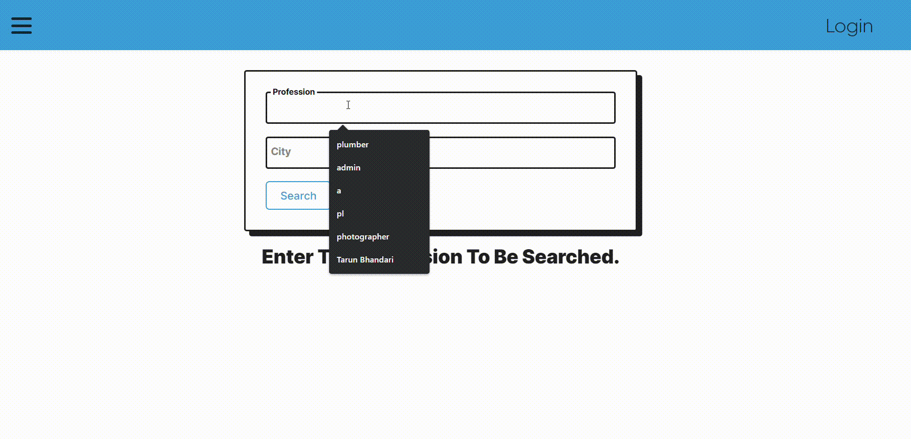
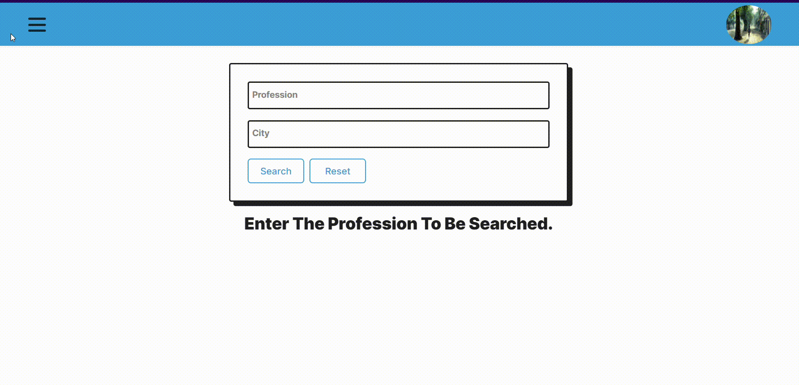

# Overview
This MERN (MongoDB, Express.js, React.js, Node.js) project allows users to search for professions in specific cities. If the profession is found, users can view details of providers linked with that profession. If the profession is not found, users can create a new profession. The system supports two types of users: normal users and providers. Providers have the ability to create new professions or link with existing ones. Middleware functionality restricts unauthorized access, allowing only logged-in users to access certain routes.

## Features
**Profession Search:** Users can search for professions in specific cities.
**Provider Details:** Users can view details of providers linked with a profession.

Profession Creation: Users can create new professions if they are not found in the system.

User Authentication: JWT-based authentication ensures secure access to routes and features.
User Roles: Two types of users are supported: normal users and providers.
Provider Actions: Providers can create new professions or link with existing ones.
Middleware Functionality: Unauthorized users are restricted from accessing certain routes based on their authentication status and user role.

## Technologies Used
Frontend: React.js, React Router, Bootstrap
Backend: Node.js, Express.js, MongoDB, Mongoose
Authentication: JSON Web Tokens (JWT)
Middleware: Express.js middleware for route protection
Other Tools: Axios for HTTP requests, bcrypt for password hashing

## Installation
Clone the repository: git clone <repository-url>
Navigate to the project directory: cd <project-directory>
Install dependencies: npm install
Set up environment variables: Create a .env file and configure environment variables (e.g., database connection string, JWT secret)
Start the server: npm start
Navigate to http://localhost:3000 in your browser to view the application

##Usage
Sign up or log in to access the full functionality of the application.
Use the search feature to find professions in specific cities.
View details of providers linked with a profession if available.
Create a new profession if it is not found in the system.
Providers can create new professions or link with existing ones from their dashboard.
Contributing
Contributions are welcome! Feel free to submit bug reports, feature requests, or pull requests.
